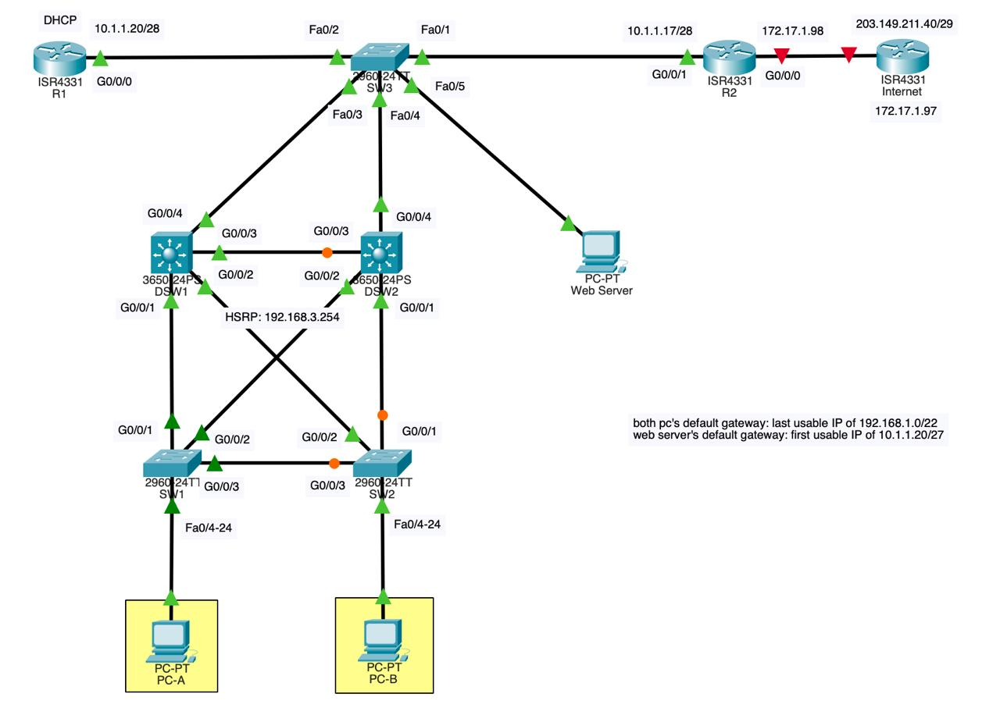

objectives:
- DSW1 and DSW2 redundant 
- all communications between PCs within VLAN 10 will go through the direct link between sw1 and sw2
- any pc plugged into the access switches sw1 and sw2 any port (ports 4-24) should be able to access the LAN and the Internet

i assume that means that we have to set up NAT/PAT overload
HSRP, DHCP, and Static NAT for the web server

i hope i got all the ip address calculation correct
public ip range: 209.149.211.40/29
so i had the public pool ip of .42-.46
since .47 is the broadcast ip 
and .40 is the network ip
and .41 is the public ip of the web server (assumed)

internal ip range: 192.168.1.0/22
so i thought it would be 192.168.0.0 - 192.168.3.255 
and since .255 is the broadcast ip
then the default gateway of the pcs would be 192.168.3.254

another ip range: 10.1.1.20/28
the default gateway of the web server is the first usable ip address which is 10.1.1.17 i think and that is the ip address of the R2 on the interface G0/0/1

they also gave me the ip of the edge router facing the isp being 172.17.1.98/30 which i guessed the ip of the ip to be .97 since .96 is the network ip and then .99 is the broadcast ip which only leaves .97

private ip of the web server: 10.1.1.30

however i dont really get what they mean by this: "all communications between PCs within VLAN 10 will go through the direct link between sw1 and sw2" and im not sure how to make sure it will work either so i was deciding between RSTP and OSPF but in the end i implemented both of them

questions:
what exactly are the requirements for HSRP and does the dsw need an ip for each device when they already have hsrp? im not sure at all
also im not sure if i configured my ospf correctly
also im not sure if im supposed to configure ports as trunks beyond the dsw (i.e at sw3)

R1:
int g0/0/0
ip add 10.1.1.20 255.255.255.240
no shut
==ip route 0.0.0.0 0.0.0.0 10.1.1.17== (ip route 192.168.0.0 255.255.252.0 G0/0/0 192.168.3.254 is wrong)
==ip route 192.168.0.0 255.255.252.0 10.1.1.18==

ip dhcp excluded-addresses ==192.168.3.252== 192.168.3.254
ip dhcp pool IP_POOL
network 192.168.0.0 255.255.252.0
default-router 192.168.3.254 
dns-server 8.8.8.8

R2:
ip route 0.0.0.0 0.0.0.0 172.17.1.97

int g0/0/0
ip add 172.17.1.98 255.255.255.252
no shut
ip nat outside

int g0/0/1
ip add 10.1.1.17 255.255.255.240
no shut
ip nat inside

ip nat inside source static 10.1.1.30 209.149.211.41
access-list 1 permit 192.168.0.0 0.0.3.255
ip nat pool PUBLIC_IP 209.149.211.42 209.149.211.46 ==netmask== 255.255.255.248
ip nat inside source list 1 pool PUBLIC_IP overload

==ip route 192.168.0.0 255.255.252.0 10.1.1.18== ip route 192.168.0.0 255.255.252.0 g0/0/1 192.168.3.254 (im not sure if this is necessary)
==ip route 192.168.0.0 255.255.252.0 10.1.1.19 10==

DSW1:
==i hope i wrote ip routing==
vlan 10 
==vlan 20==
int range g1/0/1-4
sw mode trunk
int vlan 10
standby version 2
standby 1 ip 192.168.3.254
standby 1 priority 150
standby 1 preempt
ip route 0.0.0.0 0.0.0.0 10.1.1.17
==int vlan 10==
ip helper-address 10.1.1.20
==int vlan 20
ip address 10.1.1.18 255.255.255.240==

DSW2:
==ip routing==
vlan 10
==vlan 20==
int range g1/0/1-4
sw mode trunk
int vlan 10
standby version 2
standby 1 ip 192.168.3.254
standby 1 preempt
ip route 0.0.0.0 0.0.0.0 10.1.1.17
==int vlan 10==
ip helper-address 10.1.1.20
==int vlan 20
ip address 10.1.1.19 255.255.255.240==


SW1:
vlan 10
int range g1/0/1-3
sw mode trunk
int range g1/0/4-24
sw mode access
sw access vlan 10
spanning-tree vlan 10 root primary

SW2:
vlan 10
int range g1/0/1-3
sw mode trunk
int range g1/0/4-24
sw mode access
sw access vlan 10
spanning-tree vlan 10 root secondary

SW3:
==vlan 10 
vlan 20  # For the Web Server / DMZ area 
exit
int range g1/0/1-2
sw mode access
sw access vlan 20
int range g1/0/3-4 
sw mode trunk 
int g1/0/5 
sw mode access 
sw access vlan 20==


```c
ERROR:
HSRP requires three IPs per vlan, i only had the IP of the HSRP.
DSW1 physical SVI: 192.168.3.252
DSW2 physical SVI: 192.168.3.253

VERY CONFUSED WHEN TO USE OSPF OR DEFAULT ROUTE

VERY BIG MISTAKE:
forgot you cannot travel between subnets (e.g 10.1.1.17 to 192.168.3.254 you need an intermediary svi on the dsw so the vlan 20 was added to allow the dsw to have another SVI ip for the R1 and R2 to default route to)

r2 has 2 default gateways but one has adminsitrative distance of 10 for the two dsws as backup

i get why below the dsw everything has to be trunks that is because the dsw are incharge of layer 3 inter vlan routing but then im not clear on why sw3 needs trunking after that i thought by right that you didnt need to configure sw3 at all (that was until we required the vlan 20)
```